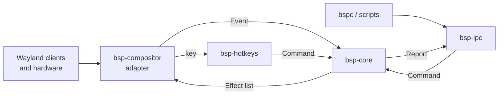

# bspwm for Wayland — Design

As of 2026-01-07.

## Overview

The goal is a Wayland compositor with exact bspwm behavior, written in Rust on Smithay, stable enough for everyday use and lighter on CPU and memory than typical compositors.

Decisions so far:

| Topic | Decision | Why |
| --- | --- | --- |
| Language | Rust | Memory safety: a compositor crash takes down the whole session |
| Library | Smithay | Pure Rust, no fragile FFI; backed by System76 (COSMIC) and used by niri |
| wlroots bindings | Not used | C-owned lifetimes and per-release API breaks make safe bindings costly |
| Keybindings | Bundled sxhkdrc-compatible parser | Wayland has no global key grabs; existing sxhkdrc keeps working |
| Control | `bspc`-compatible socket IPC | Existing `bspwmrc` and scripts work unchanged |
| GPUs | Renderer behind Smithay's traits: OpenGL ES default, optional Vulkan, Pixman fallback | Intel, AMD, NVIDIA (555+) and hybrids with no per-vendor code |
| Effects | None | bspwm never had them; they cost CPU and GPU time |

How these docs are kept: this file holds the design, budget and roadmap. Each crate has its own file describing its modules and public functions. Every function added, changed or removed is recorded both in its crate's file and in `CHANGELOG.md`, in the same commit as the code.

## Development rules

Work one roadmap step at a time, in order; a step is done only when its tests pass, clippy is clean and its docs are updated.

**Repository layout**

```
Cargo.toml             (workspace)
crates/bsp-core/       (library, no Wayland dependencies)
crates/bsp-ipc/        (library)
crates/bsp-hotkeys/    (library)
crates/bsp-compositor/ (binary: bspwm-rs)
crates/bspc-rs/        (binary: bspc-rs)
docs/design.md         (this file)
docs/<crate>.md        (one per crate)
docs/migrating.md
CHANGELOG.md
```

**Documentation rule**: every function added, changed or removed updates the Public functions table in `docs/<crate>.md` and adds a row to `CHANGELOG.md` (date, crate, Added/Changed/Removed, function, summary) in the same commit. A design decision changes `docs/design.md`.

**Hard rules**

1. `bsp-core` never depends on `smithay`, `wayland-server` or `calloop`; a CI step checks `cargo tree -p bsp-core`.
2. `unsafe` only in `bsp-compositor`, each block with a `// SAFETY:` comment.
3. No `unwrap` or `expect` on runtime paths in `bsp-compositor`: a panic there ends the user's whole session.
4. `#![deny(missing_docs)]` in every crate; `cargo clippy -- -D warnings` passes.
5. bspwm 0.9.12 is the behavior reference. For any behavior, default value or wire format, read its source (`github.com/baskerville/bspwm`, tag `0.9.12`) instead of guessing, and name the source file and function in a code comment.
6. The Performance budget rules are requirements: no allocation per frame in the render path, no timers at idle, no effects.
7. If Smithay lacks something, or a behavior cannot match bspwm, stop and ask the user; if agreed, add it to the Deliberate deviations table. Never invent a workaround silently.

**Core definition of done**: every tree operation implemented with a unit test per operation mirroring bspwm's behavior, property tests for the invariants in `docs/bsp-core.md`, and the Public functions table filled in.

## Architecture

All bspwm logic lives in pure Rust crates that never import Smithay; only `bsp-compositor` touches Wayland. This is a functional core with an imperative shell: the core takes plain events and returns plain effects.

| Crate | Role | Depends on |
| --- | --- | --- |
| `bsp-core` | Tree, monitors, desktops, node states and flags, presel, receptacles, rules, settings | nothing Wayland-related (serde only, for JSON dumps) |
| `bsp-ipc` | Socket protocol byte-compatible with bspwm, command parser, `subscribe`, `wm -d` JSON | `bsp-core` |
| `bsp-hotkeys` | sxhkdrc parser and chord matcher | `xkbcommon` keysym names only |
| `bsp-compositor` | Binary: rendering, input, outputs, protocols, XWayland, event loop | Smithay + the three crates above |
| `bspc-rs` | Binary: command-line client, same arguments and exit codes as `bspc` | `bsp-ipc` wire module only |



Events flow in (`WindowMapped`, `OutputAdded`, `KeyPressed`), the core mutates its state, and it returns effects (`Configure { id, rect }`, `Focus`, `SetBorder`, `EmitEvent`, `Spawn`) that the adapter applies.

Rules that keep it decoupled:

- `bsp-core` uses its own `WindowId(u32)` and `Rect`; the adapter keeps the map from `WindowId` to Smithay windows.
- The core never calls out; it only returns effects, so it is deterministic and testable without a display.
- CI fails if `cargo tree -p bsp-core` lists `smithay`, `wayland-server` or `calloop`.
- Porting to another library means rewriting `bsp-compositor` only.

## Performance budget

Targets, not yet measured: 0% CPU at idle and under 40 MB resident memory without XWayland. They are checked with perf and heaptrack before each release in fixed scenarios: idle with 10 windows and waybar, fullscreen video playback, and sustained fast typing (input-to-screen latency).

| Area | Rule | Saves |
| --- | --- | --- |
| Rendering | One damage tracker per output; redraw only changed regions | GPU and CPU per frame |
| Rendering | Direct scanout for fullscreen windows through Smithay's DRM compositor | Composition of video and games |
| Rendering | Borders are solid-color rectangles; no blur, shadows, rounding or animation | Shader and texture work |
| Idle | Fully event-driven calloop loop; no timers when nothing happens | Wakeups at idle |
| Idle | Frame callbacks only to visible windows | Hidden clients stop rendering |
| Memory | Tree is an arena of nodes addressed by `u32` indices; no `Rc<RefCell>` | Allocations and pointer chasing |
| Memory | Render element buffers reused across frames | Per-frame allocation |
| Memory | XWayland starts only when an X11 client connects | About 20–50 MB when unused |
| Build | Unused Smithay features off; `lto = "fat"`, `codegen-units = 1`, `panic = "abort"`, `strip = true` | Binary size and startup |

The nested winit backend used for development sits behind a cargo feature and is left out of release builds.

## Compatibility

The reference for "exact behavior" is bspwm 0.9.12, the current stable release ([Arch package](https://archlinux.org/packages/extra/x86_64/bspwm/)), and it is checked by differential testing rather than by reading alone.

- **Differential testing**: real bspwm runs headless on Xvfb in CI. The same `bspc` command sequences go to it and to `bsp-core`, and their `wm -d` dumps and `query` outputs must match, apart from the deviations below.
- **Window IDs**: printed in bspwm's hex format (`0x00C00003`). XWayland windows use their real X11 IDs; native Wayland windows get IDs from a range X11 never uses.
- **Monitor names**: DRM connector names (`eDP-1`, `HDMI-A-1`, `DP-2`), which mostly match what xrandr reports.
- **Units**: `border_width`, `window_gap`, padding and split rectangles are logical pixels; with a scale of 2, a 2 px border is 4 physical pixels.
- **Rules**: native Wayland windows match `app_id` as class and instance, and title as name; XWayland windows keep real class and instance.

### Deliberate deviations

| bspwm behavior | Here | Why |
| --- | --- | --- |
| `bspc wm -r` restarts and keeps windows | Live reload: re-reads `bspwmrc` and sxhkdrc without restarting | Restarting a Wayland compositor kills every client |
| `--dump-state` / `--load-state` across restarts | Kept for debugging only | No restart to survive |
| EWMH and ICCCM atoms | foreign-toplevel and ext-workspace protocols; EWMH still served to XWayland clients | Wayland has no root window properties |
| `_NET_WM_STRUT` reserves space for panels | layer-shell exclusive zones | Wayland panels use layer-shell |
| sxhkd as a separate program | Bundled in `bsp-hotkeys` | No global key grabs on Wayland |
| `xdo`, `xprop`, `wmctrl` on window IDs | Work on XWayland windows only | They are X11 tools |

## Configuration beyond bspwm

A typical `bspwmrc` calls `xrandr`, `setxkbmap` and `xinput`, which do nothing on Wayland, so their jobs move into new `bspc` domains and standard protocols.

| X11 tool in `bspwmrc` | Replacement | Example |
| --- | --- | --- |
| `xrandr` | `bspc output <name> …`, plus wlr-output-management so kanshi and wlr-randr work | `bspc output eDP-1 mode 1920x1080@60 scale 1.25 position 0,0` |
| `setxkbmap` | `bspc input keyboard …` | `bspc input keyboard layout us,ro options grp:alt_shift_toggle` |
| `xset r rate` | `bspc input keyboard repeat <delay> <rate>` | `bspc input keyboard repeat 250 40` |
| `xinput set-prop` | `bspc input <type or device name> <setting>`, covering libinput options | `bspc input touchpad tap on natural_scroll on accel 0.3` |
| `xsetroot -cursor_name` | `bspc config cursor_theme`, `cursor_size` | `bspc config cursor_theme Adwaita` |

These are extensions to `bspc`; stock bspwm rejects them, so a shared `bspwmrc` can guard them with a check for the Wayland session.

## Session, security and operations

Screen sharing and file pickers work through xdg-desktop-portal, the IPC socket is private to you, and every crash leaves a log.

- **Portals**: xdg-desktop-portal-wlr for screen sharing and screenshots (it uses the screencopy protocol), xdg-desktop-portal-gtk for file pickers. `XDG_CURRENT_DESKTOP` is set so the portal picks these.
- **Environment export**: before running `bspwmrc`, the compositor sets `WAYLAND_DISPLAY`, `BSPWM_SOCKET`, `XDG_CURRENT_DESKTOP` and `XDG_SESSION_TYPE`, and pushes them to D-Bus and systemd so portals and services see them.
- **IPC socket**: created in `XDG_RUNTIME_DIR` with mode 0600, in a directory only you can read.
- **Privileged protocols**: screencopy, virtual keyboard and pointer, gamma control and output management are offered only to clients the compositor started itself or that come through the portal. Sandboxed (Flatpak) clients are refused them through the security-context protocol.
- **Logging**: the `tracing` crate, with levels set by `BSPWM_LOG` (for example `BSPWM_LOG=info,bsp_core=debug`), written to `$XDG_STATE_HOME/bspwm-rs/log`.
- **Crashes**: a panic hook writes the message, backtrace and last 200 log lines to a crash file before `panic = "abort"` exits; you send that file back when something breaks.

## Reliability and daily use

A broken config must never lock you out, and every risky backend is tested in a VM before it reaches your real session.

- **Emergency keys**: hardcoded, independent of sxhkdrc: Ctrl+Alt+F1–F12 switch TTY, and Ctrl+Alt+Shift+Escape quits `bspwm-rs`. The quit key is implemented and live-verified (`crates/bsp-compositor/src/input.rs` `is_emergency_quit`, `docs/bsp-compositor.md` Hotkeys progress); TTY switching is implemented on the `real` backend (`input::vt_switch_target`, `udev_backend`) and live-verified in a VM; the nested backend has no VT to switch.
- **Fallback config**: if sxhkdrc or `bspwmrc` fails to load, minimal defaults apply (open a terminal, quit) and the error is shown on screen.
- **VM stage**: between nested testing and bare metal, `bspwm-rs` runs in a QEMU VM with a virtio GPU to exercise the real DRM backend safely.
- **Suspend and TTY switching**: logind pause and resume signals restore outputs and GPU state; the screen locks before sleep.
- **Frame timing**: each output renders on its own schedule, as close to its refresh as possible, so mixed 60 Hz and 144 Hz monitors both stay smooth; adaptive sync (VRR) is optional.
- **Session entry**: `bspwm-rs.desktop` in `/usr/share/wayland-sessions` for display managers, plus a plain launcher for starting from a TTY.
- **Code docs**: `#![deny(missing_docs)]` on every crate's public API, so each public function has a doc comment that its crate file mirrors.

## Documentation and maintenance

User docs cover only what differs from bspwm, and dependencies and performance change only on purpose.

- **Migration guide**: `docs/migrating.md` lists every change an existing `bspwmrc` needs: `xrandr`, `setxkbmap` and `xinput` to `bspc-rs output` and `input`; polybar to waybar; picom removed; `bspc` versus `bspc-rs`. It doubles as the checklist for testing on a real config.
- **Man pages**: `bspwm-rs(1)` and `bspc-rs(1)`, generated from the same source as `--help`, documenting extensions and deviations and pointing to bspwm's man page for everything identical.
- **Keep the X11 session**: bspwm on X11 stays installed and selectable in the display manager until `bspwm-rs` has run for a few weeks without crashes.
- **Performance regressions**: CI benchmarks tree layout and IPC parsing on every change and fails on a notable slowdown; idle CPU and memory are still measured on real hardware.
- **Smithay pinned to a commit**: upgraded deliberately, one step at a time, with each upgrade recorded in the changelog.
- **Fuzzing**: both the IPC parser and the sxhkdrc parser are fuzzed, since both read input that can be malformed.

## Project basics

The project is BSD-2-Clause, like bspwm, so logic ported from bspwm's source keeps its license notice; Smithay's MIT license is compatible.

| Item | Decision |
| --- | --- |
| License | BSD-2-Clause, with bspwm's copyright notice kept wherever its logic is ported |
| Minimum Rust version | Smithay's minimum at the time of writing, raised only on purpose and noted in the changelog |
| CI checks | `cargo fmt`, `clippy -D warnings`, tests, property tests, differential tests against bspwm, every renderer feature combination, and the `bsp-core` dependency check |
| `bspc` | `bspc-rs`, a compatible client, named to avoid clashing with bspwm's `bspc`; scripts that call `bspc` still work through the stock `bspc` with `BSPWM_SOCKET` set |
| Binary name | `bspwm-rs`, distinct from `bspwm` so both can be installed side by side |

## Roadmap

The core and the IPC need no display and can be fully tested in CI; from the nested compositor on, each step is tested on the user's machine.

| # | Step | Delivers | Tested by | Status |
| --- | --- | --- | --- | --- |
| 1 | Core | Tree and every operation (split, rotate, flip, balance, equalize, circulate, swap, transplant), desktops, monitors, rules; unit and property tests | CI: unit, property and differential tests against bspwm 0.9.12 | Done (differential testing against real bspwm needs bsp-ipc's wire format, the IPC) |
| 2 | IPC | bspwm socket protocol, all `bspc` domains, `subscribe`, `query`, `wm -d` JSON; tested against a fake adapter | CI: fake adapter, differential tests against bspwm 0.9.12 | Done, including wired into a live compositor: wire framing, full command parsing, selector parsing/structural resolution, report/event/JSON formatting, the executor, `FakeAdapter`, a real non-blocking socket server, and a working `bspc-rs` client — exercised end to end both in `crates/bsp-ipc/tests/integration.rs` and against the real, running `bspwm-rs` (`docs/bsp-compositor.md`, Nested compositor progress: `bspc-rs query`/`node -t floating` against a live `alacritty` client). `node --move`/`--resize` are also now implemented and live-verified, ported from bspwm 0.9.12's actual `src/tree.c`/`src/window.c` source (fetched and read directly rather than recalled) and confirmed against two real clients on a running compositor. Remaining: differential testing against real bspwm (needs Xvfb CI infra), and the deferred executor/selector gaps `docs/bsp-ipc.md`'s IPC progress section lists (cross-tree `node --swap`, focus history, the stacking list) |
| 3 | Nested compositor | winit backend, xdg-shell, tiling through the core, focus, borders | User, inside current session | Done for the core loop plus IPC plus rule matching: run and confirmed against real clients (tiling, focus, borders, multi-window splits) inside a live Wayland session, `bsp-ipc`'s socket server is wired into the event loop — `bspc-rs` commands (`query`, `node -t floating`, `wm -g`, `rule`, …) work against the running compositor end to end — and `bspc rule` entries are matched against a window's `app_id`/title at map time and applied (`docs/bsp-compositor.md`, Nested compositor progress). Not done: `bsp-hotkeys`, `bspwmrc`, rule `monitor=`/`desktop=`/`node=`/`rectangle=` targeting, `manage=false`, `center`/`follow`, popup grabs, xdg-decoration, a generic (non-`GlesRenderer`-only) renderer |
| 4 | Hotkeys and config | sxhkdrc parser, chords, pointer bindings, `bspwmrc` run at startup, live reload | User, nested | `bsp-hotkeys`' pure grammar/matcher, its `bsp-compositor` wiring, the `Ctrl+Alt+Shift+Escape` emergency quit key, running `bspwmrc` at startup, and `SIGUSR1` sxhkdrc reload are all done and live-verified: sxhkdrc is read at startup and matched against real keyboard events end to end, both dispatch paths (`Dispatch::InlineBspc`/`Shell`) and an explicit `shift`-modified chord confirmed against a running compositor and a real client (catching and fixing two real bugs along the way); the emergency key was confirmed with no sxhkdrc loaded at all; `bspwmrc` is resolved from the same path and `execl`'d the same way bspwm itself does, confirmed via a test script receiving its run-level argument; `SIGUSR1` was confirmed by swapping sxhkdrc mid-run and checking the old binding stopped firing while the new one worked; `bspc config hotkeys_inline_bspc` (the off switch forcing every binding through the shell) is implemented as a compositor-local `State` field and confirmed live in both states, over the socket and via real key presses; `bspc wm -r` re-runs `bspwmrc` and re-reads sxhkdrc as a live reload rather than restarting the process (this row's own "restarting kills every client" decision), confirmed live via a test `bspwmrc`'s marker file and a swapped sxhkdrc, both over the socket and via a hotkey bound to `bspc wm -r`; pointer bindings (`bspc config pointer_modifier`/`pointer_action1..3`/`click_to_focus`) are also done, ported from bspwm 0.9.12's actual `src/pointer.c`/`src/events.c`/`src/window.c` source and confirmed live against two real clients — dragging a floating window (move and resize from a corner) and dragging one tiled window into another (confirming the swap) (`docs/bsp-hotkeys.md`/`docs/bsp-compositor.md`, Hotkeys progress); full modifier coverage (`hyper`/`meta`/`mode_switch`/`mod1`..`mod5`, alongside the already-working `shift`/`control`/`lock`/`alt`/`super`) is also done and live-verified, for both sxhkdrc chords and `pointer_modifier` (`docs/bsp-compositor.md`, Hotkeys progress — includes a real bug found and fixed by that live testing, not just the feature itself). |
| 5 | Real hardware | DRM/KMS, udev, libseat, multi-monitor, hotplug, hybrid GPUs, `bspc output` and `bspc input` commands | User, bare TTY | Done (all live-verified in QEMU VMs except where noted): `bsp-core`'s monitor position ordering (`Rect::compare`/`Wm::reorder_monitor`, porting bspwm's `rect_cmp()`/`reorder_monitor()`), `bspc output`/`bspc input`'s grammar and wire plumbing (`bsp-ipc`), and a libseat session + udev device enumeration probe (`bsp-compositor::udev_backend`, cargo feature `real`) are done and live-verified in an isolated QEMU VM — session open/pause/resume and GPU/device enumeration all confirmed against real (virtual) hardware, see `docs/bsp-compositor.md`. Stage C is done and live-verified in the VM: `State` is generic over a `Backend` trait and `udev_backend` is a full DRM/KMS backend (GBM/EGL, per-connector `Output` + `Monitor`, connector hotplug, vblank-driven rendering, libinput). Stage D is done too: `Ctrl+Alt+F1`–`F12` switches VT and back, with session pause/resume restoring rendering. Stage E is done and live-verified: `bspc output`/`bspc input` drive real DRM modes/scale/position, keyboard repeat and pointer acceleration. Cursor drawing is done too (xcursor default arrow or client surface, live-verified). `linux-dmabuf` is advertised and imports on the primary GPU (verified with a virgl GPU: 3 client dmabufs imported, an EGL client at ~630 FPS). Hybrid GPUs are implemented (render on the primary, copy to a secondary's scanout, with fallback), verified only with two *software-rendered* virtual GPUs — real dual-GPU hardware (e.g. integrated + discrete) is untested, with debug logging to diagnose it (`docs/bsp-compositor.md`, "Hybrid GPUs"); GPU hot-remove/add was verified, connector-level hotplug (a monitor plugged in/out) was not (no way to simulate it in the VM). Not implemented: presentation-time, DRM lease, explicit sync, tablet/touch |
| 6 | Protocols | layer-shell (waybar), xdg-output, foreign-toplevel, ext-workspace, screencopy, session lock, idle, clipboard, output management, gamma control, virtual keyboard and pointer, input method, xdg-activation, shortcuts inhibit, tearing control, security context; portals | User | Not started |
| 7 | XWayland | Lazy start, X11 class and instance for rules | User | Not started |
| 8 | Hardening | IPC fuzzing, profiling against the budget, fractional scaling, pointer constraints for games | CI and user | Not started |

## Crate docs

- [bsp-core](bsp-core.md)
- [bsp-ipc](bsp-ipc.md)
- [bsp-hotkeys](bsp-hotkeys.md)
- [bsp-compositor](bsp-compositor.md)

Every added, changed or removed function is logged in [CHANGELOG.md](../CHANGELOG.md).
